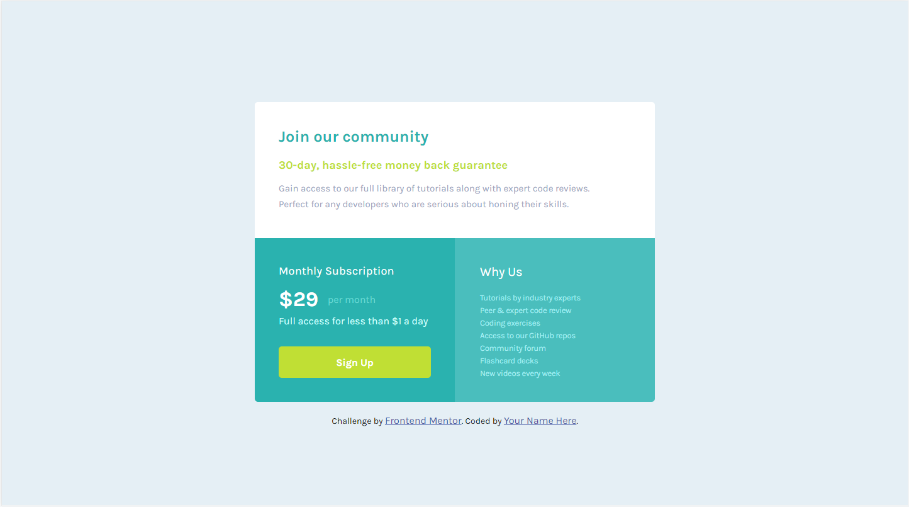

# Frontend Mentor - Single price grid component solution

This is a solution to the [Single price grid component challenge on Frontend Mentor](https://www.frontendmentor.io/challenges/single-price-grid-component-5ce41129d0ff452fec5abbbc). Frontend Mentor challenges help you improve your coding skills by building realistic projects.

## Table of contents

- [Overview](#overview)
  - [The challenge](#the-challenge)
  - [Screenshot](#screenshot)
  - [Links](#links)
- [My process](#my-process)
  - [Built with](#built-with)
  - [What I learned](#what-i-learned)
  - [Useful resources](#useful-resources)
- [Author](#author)

## Overview

### The challenge

Users should be able to:

- View the optimal layout for the component depending on their device's screen size
- See a hover state on desktop for the Sign Up call-to-action

### Screenshot

### Links

- Solution URL: [Github - Repository](https://github.com/Arfirpo/single-price-grid-component-master)
- Live Site URL: [Solution - Github Page](https://arfirpo.github.io/single-price-grid-component-master/)

## My process

### Built with

- Semantic HTML5 markup
- CSS custom properties
- Flexbox
- CSS Grid
- Mobile-first workflow

### What I learned

take advantage of this challenge to improve my grid display skills.

### Useful resources

- [imagecolorpicker.com](https://imagecolorpicker.com/es) - this page helped me to get the values of those colors that were not specified in the style guide

## Author

- Website - [Linkedin - Agustín R. Firpo](https://www.linkedin.com/in/agustin-rodrigo-firpo-0aa86697/)
- Frontend Mentor - [@Arfirpo](https://www.frontendmentor.io/profile/Arfirpo)
